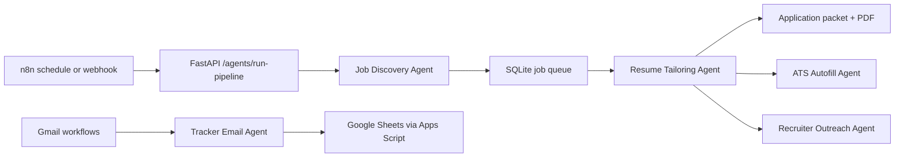

# CareerSite Agent Architecture

The project now has a local multi-agent layer behind FastAPI. n8n remains the scheduler and router, while Python owns the business logic, scoring, resume packet generation, autofill state, recruiter draft creation, and tracking.

## Agent Responsibilities

| Agent | Goal | Main Tools |
| --- | --- | --- |
| Job Discovery | Find profile-relevant jobs, reject obvious non-fits, and enqueue high-fit leads. | Target company scrapers, job quality gate, fit scorer, SQLite queue |
| Fit Scoring | Decide whether a job is worth applying to. | JD parser, resume scorer, optional Claude/Ollama reasoning |
| Resume Tailoring | Build a tailored application packet and PDF-ready resume output. | Pipeline service, packet exporter, resume renderer |
| ATS Autofill | Arm browser autopilot for safe ATS prefill. | FastAPI autopilot state, Brave extension, ATS answer bank |
| Recruiter Outreach | Find likely recruiters and draft outreach notes. | LinkedIn search URL generator, outreach draft service |
| Tracker Email | Classify Gmail updates and update tracking when the match is known. | Email status rules, tracker service, Apps Script writer |
| Career Orchestrator | Run the end-to-end job application pipeline. | All agents plus queue processor |

## Orchestration

## Human Boundary

Agents may search, score, tailor, prepare, prefill, and log. They should not click final submit on a live job application unless that boundary is explicitly changed later.

## Cost Controls

The default mode stays deterministic where possible. LLM calls are optional per request and should be used for high-value steps: final job-fit reasoning, resume tailoring, ambiguous ATS questions, and recruiter note drafting. The local pipeline passes compact structured data to the LLM instead of full raw state whenever possible.

## n8n Workflows

`WF7_Career_Agent_Orchestrator.json` is the production-facing orchestrator export. It calls `POST /agents/run-pipeline`, processes a bounded number of jobs, renders PDFs, and prepares recruiter drafts. The Discord node intentionally ships with a placeholder webhook in source control so live credentials stay only in n8n.
